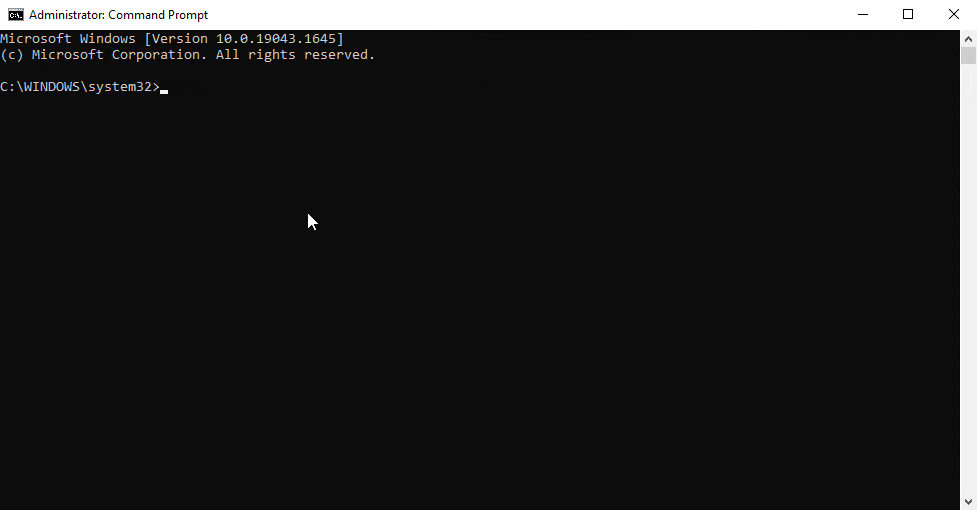

# syswipe
A silent* batch oneliner* to securely erase personal documents



Contents
========

 * [Disclaimer](#disclaimer)
 * [Why?](#why)
 * [Script](#script)
 * [Use](#use)
 * [Recommendations](#recommendations)
 * [What it will do](#what-it-will-do)
 * [What it isn't](#what-it-isnt)
 * [Notes](#notes)
 * [License](#license)

### Disclaimer
---

I am **NOT** responsible for anything that happens to your or someone else’s computer as a result of running **ANY** scripts included in this repository and file. Only use the scripts in this repository and file on a computer **YOU OWN** or have permission **FROM THE OWNER** to use it on with their understanding of what it will do **AFTER** reading and understanding **ALL** of the following text. You **WILL NOT** be asked for confirmation after running **ANY** of these scripts. By using this software you accept all risk and accountability.

The [program](https://docs.microsoft.com/en-us/sysinternals/downloads/sdelete) that all of these scripts use for secure deletion is only intended for hard drives and I **CAN NOT** guarantee your data will be permanently erased if you are using them with an SSD. Most SSD manufacturers such as Samsung will have a purpose built tool to securely erase their SSD's without damaging the drive. You can read a little more about the program at [What it isn't](#what-it-isnt).

This program exclusively supports the Windows operating system (Windows Vista and higher)

### Why?
---

To give people a convenient way to securely erase their data without having any technical knowledge when selling/throwing away their computer.

### Script
---

#### Oneliner:

```
powershell -command "Invoke-WebRequest "https://download.sysinternals.com/files/SDelete.zip" -OutFile %temp%\a.zip" & cd %temp% & powershell -command "Expand-Archive .\a.zip -Force" & powershell -command "rm "a.zip" -Force" & a\sdelete.exe /accepteula -nobanner >nul & a\sdelete.exe -r -s -f -nobanner -p 3 "%UserProfile%\Documents" "%UserProfile%\Pictures" "%UserProfile%\Videos" "%UserProfile%\Music" "%UserProfile%\OneDrive" "%UserProfile%\Downloads" "%UserProfile%\Desktop" & rmdir /S /Q "a" & exit
```

[syswipe_oneliner](syswipe_oneliner)

#### Batch file:

[syswipe](syswipe)

#### Oneliner (Silent):

```
powershell -WindowStyle Hidden -command "Invoke-WebRequest "https://download.sysinternals.com/files/SDelete.zip" -OutFile %temp%\a.zip" >nul & cd %temp% >nul & powershell -command "Expand-Archive .\a.zip -Force" >nul & powershell -command "rm "a.zip" -Force" >nul & a\sdelete.exe /accepteula -nobanner >nul & a\sdelete.exe -r -s -f -nobanner -p 3 "%UserProfile%\Documents" "%UserProfile%\Pictures" "%UserProfile%\Videos" "%UserProfile%\Music" "%UserProfile%\Downloads" "%UserProfile%\Desktop" >nul & rmdir /S /Q "a" >nul & exit
```

[syswipe_oneliner_silent](syswipe_oneliner_silent)

#### Batch file (Silent):

[syswipe_silent](syswipe_silent)

### Use
---

Run the [above code](#script) in the command prompt or as a batch file (you will need to add the .bat extension yourself if you download the script in order to prevent accidental execution). All of these do the same thing except for the silent versions which will hide the window before beginning. The batch file versions may help you gain a greater understanding of what this code will do and is the way I recommend running it if you intend to run this script as a batch file anyway. The batch file code also makes modifying the script a little easier. All of these are hosted as batch files in this repo and are each linked [above](#script) under their related heading. The oneliner exists for quick one time use without requiring a download. If you are using the silent version of this script after execution simply wait a reasonable amount of time based on how many files you have and the size of them as there will be no completion message (you may add one yourself).

### Recommendations
---

* Add any directories you require to be securely erased that are not included in [this list](#what-it-will-do)

* Close all possible applications before running

* Run as an administrator to give it as much access to the file system as possible.

* If you are using the silent script you will not receive error/success messages so **CHECK YOUR FILES WERE REMOVED**.

* If you don’t understand the code don’t attempt to modify it otherwise modify the script to meet your needs

* Only use the oneliner for one time use where you don’t wish to download anything as it is more stable to use the batch file version of this code.

* Don’t be an idiot

### What it will do
---

If you are using the silent version it will begin by hiding its window all actions after this are the same between versions. It then downloads the sdelete(https://docs.microsoft.com/en-us/sysinternals/downloads/sdelete) tool to a temporary directory and uses it to recursively secure deletes all files and folders in the following paths

Note: %UserProfile% stands for the current users profile name (it will only securely delete the current users files)
```
%UserProfile%\Documents
%UserProfile%\Pictures
%UserProfile%\Videos
%UserProfile%\Music
%UserProfile%\Downloads
%UserProfile%\Desktop
```

that it can access with 3 passes (more than enough to make data unrecoverable) before cleaning up almost all remnants of it on your system.

### What it isn’t
---

This program uses a tool created by Mark Russinovich owned by Sysinternals a subsidiary of Microsoft called [sdelete](https://docs.microsoft.com/en-us/sysinternals/downloads/sdelete). I do not have any control over or access to this software. For this reason I **CAN NOT** guarantee any data will be irrecoverable as sometimes secure erasing tools (such as this one) are ineffective on SSD’S or other issues can occur. I would only use this confidently with a hard drive as this program has not been built with SSD's in mind. To securely erase an SSD your manufacturer may have a tool like Samsung's that will do it for you without damaging the drive.

This script is **NOT** as good as other software that will securely erase your whole OS while the system is powered off from for example a USB Drive. It will also not touch any files outside of the directories you tell it to meaning that if you stored your data somewhere else running this script **WILL NOT** remove it. Also since this script is run on the OS that contains the files it is bound by file permissions meaning that if it does not have access to a file or folder it will not be able to erase it and if you are using the silent version there will be no output to tell you it could/couldn’t. For this reason I will say again **CHECK YOUR FILES WERE REMOVED**.

### Notes
---

If you wish to use this script often for business or other purposes I recommend you host your own copy of sdelete or download a copy in case anything happens to the download included in this script. I also would not recommend using the silent version for this purpose.

This program automatically agrees to the EULA of [sdelete](https://docs.microsoft.com/en-us/sysinternals/downloads/sdelete) so before using any program in this repository or file download [sdelete](https://docs.microsoft.com/en-us/sysinternals/downloads/sdelete) and check you consent to the EULA. If you use this software without checking the EULA of [sdelete](https://docs.microsoft.com/en-us/sysinternals/downloads/sdelete) or reading this text as you were guided at [the beginning](#disclaimer) **YOU** are responsible for the consequences.

**Usually** just resetting your computer with the option Microsoft gives you for selling/throwing away your system (although it will take longer) will overwrite your data well enough to make it irrecoverable (not a guarantee and subject to change as I do not have control over their software). I recommend doing that after running this script if you are using this for selling/throwing your system away.

Antivirus’s currently do not recognise this code as malicious. Please do not misuse this code to ensure it is always usable for everyone.

Please ensure that anywhere else you distribute this code or a modified version of it a summary of what the program will do as well as the [What it will do](#what-it-will-do) and [What it isn’t](#what-it-isnt) sections are made available to the user.

### License
---

This project is licensed under the [MIT License](LICENSE)
